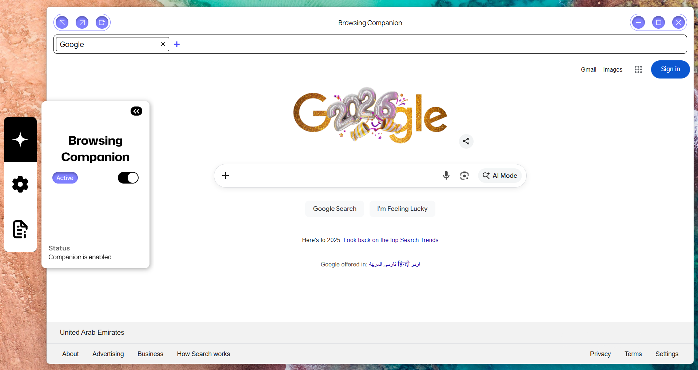

# AI-Browsing-Companion
A custom browser built with Electron equipped with an intelligent assistant that performs voice-driven, context-aware web browsing.

Core functionalities are powered by **Google Cloud Vertex AI** and **ElevenLabs**.

> **Hackathon Submission:**  
> This project was built as part of the **AI Partner Catalyst: Accelerate Innovation** hackathon,  under the **ElevenLabs Challenge**.

---
 

> **Note:** This application follows a **Bring Your Own Key (BYOK)** policy. You must supply your own API keys to use the application.

## Installation

1. Navigate to the **Releases** section of this repository.
2. Select **v1.0.0**.
3. Scroll to **Assets**.
4. Download **ai-browsing-companion-1.0.0.Setup.exe**.

> **Note:** If Windows displays a security warning, click **More info**, then **Run anyway**.  
> This warning may appear because the application is not code-signed.

---

## Configuration

To use the application, you will need:
- A **Google Cloud project**
- A **Google Cloud API key** (Vertex AI)
- An **ElevenLabs API key**

You may be prompted to create accounts with the respective providers.

---

### Google Cloud (Vertex AI)

Follow the official Google Cloud documentation to obtain an API key:

https://docs.cloud.google.com/vertex-ai/generative-ai/docs/start/api-keys?usertype=expressmode

---

### ElevenLabs

1. Create an ElevenLabs account.
2. Open the **Developer** section from the menu.
3. Under **Quick Links**, select **Create an API Key**.